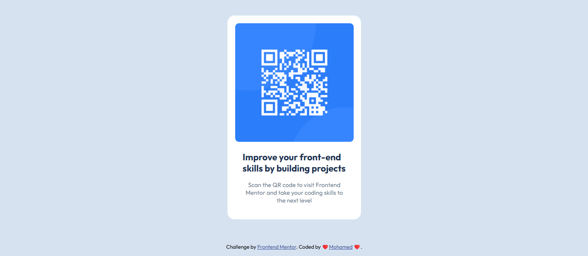

# Frontend Mentor - QR Code Component Solution

This is my solution for the **QR Code Component** challenge on [Frontend Mentor](https://www.frontendmentor.io/).  
I built it using **pure HTML & CSS** with clean structure and Flexbox for perfect centering.

---

## 🚀 Overview

- The **card** is centered both vertically and horizontally using **Flexbox**.
- The **attribution** footer is fixed at the **bottom of the page** (without using position absolute).
- The design is **responsive** and clean.
- **BEM Methodology** is used for class naming for better scalability.

---

## 📸 Screenshot

---

## 🛠️ Built with

- HTML5
- CSS3
- Flexbox
- BEM Naming Convention
- Mobile-first workflow

---

## 📚 What I learned

- How to perfectly center elements vertically and horizontally with Flexbox.
- How to stick a footer at the bottom while keeping the content centered.
- How to structure a project using semantic HTML and BEM for CSS classes.
- Clean and minimal responsive design.

---

## 📦 How to run the project

Simply open the `index.html` file in your browser! 🚀

No dependencies, no build tools, pure frontend.

---

## 🙌 Acknowledgements

Challenge by [Frontend Mentor](https://www.frontendmentor.io/challenges).  
Coded with ❤️ by [Mohamed](https://github.com/Mohamed14-7).

---
